<div align="center">


<h1>Data Platform Zone</h1>

<p><strong>The Institutional-Grade Platform for Standardized Data Landing Zone Foundations, Cloud Modernization Governance, and Multi-Cloud Data Ecosystems.</strong></p>

[]()
[]()
[]()

<br/>

> **"Industrializing data infrastructure to automate secure landing zone foundations."** 
> **Data Platform Zone** is an enterprise-grade platform designed to provide a secure, measurable, and highly automated foundation for global data estate operations. It orchestrates the complex lifecycle of data landing zones—from multi-cloud networking and identity federation to automated security baselines and unified infrastructure auditing.

</div>

---

## 🏛️ Executive Summary

Fragmented data infrastructure and manual environment provisioning are strategic operational liabilities; lack of a standardized data landing zone is a primary barrier to organizational data maturity. Organizations fail to scale their data platforms not because of a lack of storage, but because of fragmented networking standards, lack of clear security baselines, and an inability to provision compliant data environments with operational precision.

This platform provides the **Data Infrastructure Intelligence Plane**. It implements a complete **Data-Platform-Zone-as-Code Framework**, enabling Data Architects and Platform teams to manage global data foundations as first-class citizens. By automating the provisioning of isolated data spokes and orchestrating real-time security guardrails, we ensure that every organizational data asset—from Databricks workspaces to Snowflake accounts—is secure by default, audited for history, and strictly aligned with institutional cloud adoption frameworks.

---

## 📐 Architecture Storytelling: Principal Reference Models

### 1. Principal Architecture: Global Data Platform Zone & Data Infrastructure Intelligence Plane
This diagram illustrates the end-to-end flow from IaC triggering and modular provisioning to network isolation, security gating, and institutional data infrastructure auditing.

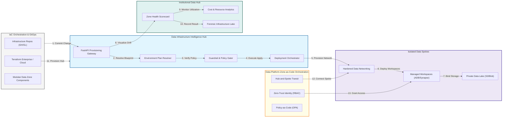

### 2. The Data Zone Lifecycle Flow
The continuous path of a cloud data environment from initial planning and modular provisioning to hardening, active deployment, monitoring, and forensic auditing.

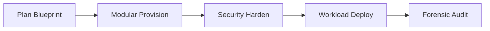

### 3. Distributed Data Fabric Topology
Strategically orchestrating standardized data landing zones across global cloud regions, diverse business units, and multi-cloud targets, providing a unified institutional view of global data health and operational readiness.

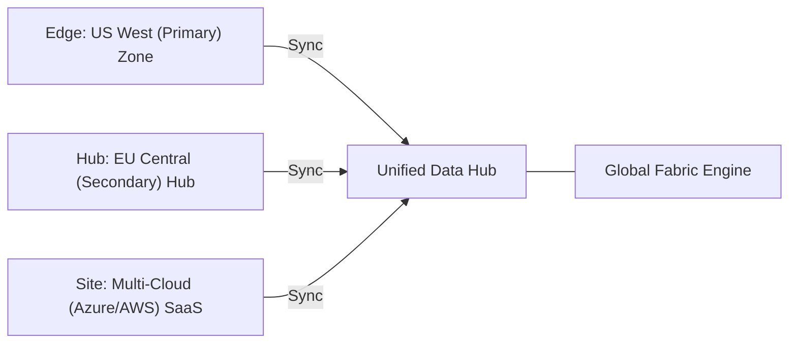

### 4. Data Zone Governance & High-Trust Identity Protection Flow
Executing complex logic for securing the bridge between data users and cloud services, ensuring every organizational identity is verified, least-privilege is maintained, and every infrastructure access is according to institutional standards.

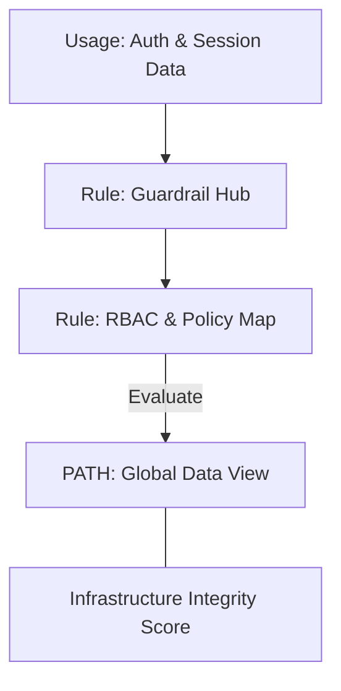

### 5. Multi-Cloud Data Federation & Governance Flow
Automatically managing unified data platform standards across global regions and diverse cloud tenants, ensuring institutional data residency and security boundaries by default.

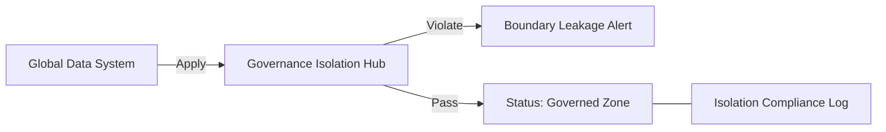

### 6. Encryption & Perimeter Protection Flow (Data Standard)
Managing the lifecycle of a data environment request, automatically enforcing institutional TLS 1.3 and resource encryption standards as required by security policy, ensuring zero-latency security confidence.

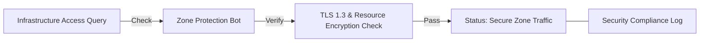

### 7. Institutional Data Zone Maturity Scorecard
Grading organizational performance based on key indicators: Provisioning Speed Efficiency, Security Compliance Index, and Resource Utilization Scores.

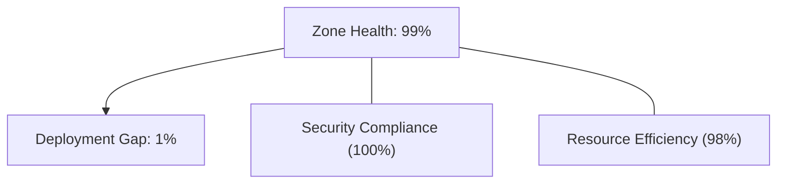

### 8. Identity & RBAC for Data Zone Governance
Managing fine-grained access to data hubs, provisioning workers, and audit logs between CDOs, Data Architects, and Platform SREs.

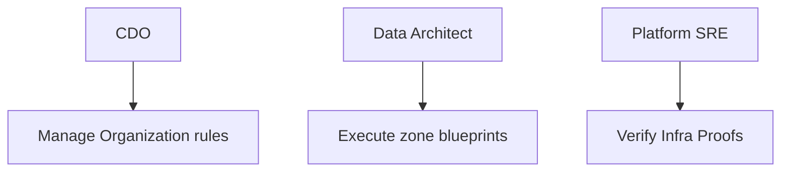

### 9. IaC Deployment: Data-Platform-Zone-as-Code Framework
Using modular Terraform to deploy and manage the versioned distribution of the data tracking hubs, policy protection workers, and forensic metadata lakes.

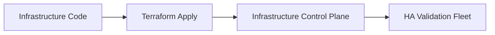

### 10. AIOps Data Zone Drift & Risk Validation Flow
Using advanced analytics to identify sudden surges in resource costs, unauthorized security group changes, suspicious configuration drifts, or unusual infrastructure pattern changes that could result in institutional risk.

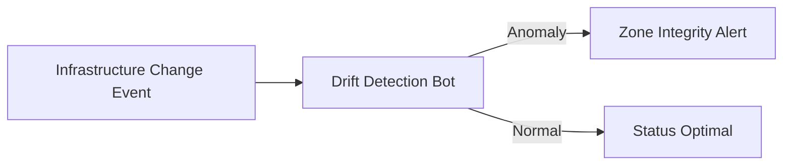

### 11. Metadata Lake for Forensic Data Zone Audit
Storing long-term records of every zone integration event (metadata), every terraform apply executed, and every security policy history for institutional record-keeping, compliance auditing, and post-provisioning forensics.

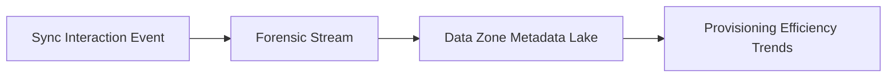

---

## 🏛️ Core Governance Pillars

1.  **Unified Foundation Coordination**: Maximizing resilience by centralizing all data infrastructure measurement through a single institutional plane.
2.  **Automated Zone Provisioning**: Eliminating "manual networking" scenarios through proactive orchestration and pattern verification.
3.  **Sequential Fabric Intelligence**: Ensuring zero-interruption operations through dependency-aware fabric-driven data engineering.
4.  **Zero-Trust Data Protection**: Automatically enforcing identity-based access, data-at-rest encryption, and policy evaluation across all infrastructure tiers.
5.  **Autonomous Operations Logic**: Guaranteeing reliability through automated industry-specific zone monitoring runbooks.
6.  **Full Infrastructure Auditability**: Immutable recording of every zone change and resource provision for institutional forensics.

---

## 🛠️ Technical Stack & Implementation

### Infrastructure Engine & APIs
*   **Framework**: Terraform 1.0+ / Bicep / FastAPI.
*   **Performance Engine**: Custom Python-based logic for multi-cloud data zone provisioning and DORA-style infra metrics.
*   **Integrations**: Native connectors for Databricks, Snowflake, Azure Fabric, and AWS Lake Formation APIs.
*   **Persistence**: PostgreSQL (Zone Ledger) and Redis (Live State Cache).
*   **Auth Orchestrator**: Federated OIDC/SAML for least-privilege infrastructure management access.

### Governance Dashboard (UI)
*   **Framework**: React 18 / Vite.
*   **Theme**: Dark, Slate, Indigo (Modern high-fidelity foundation aesthetic).
*   **Visualization**: D3.js for zone topologies and Recharts for cost/compliance analytics.

### Infrastructure & DevOps
*   **Runtime**: AWS EKS or Azure Kubernetes Service (AKS) for management plane.
*   **Infrastructure Hub**: Managed event sourcing for immutable modernization timeline reconstruction.
*   **IaC**: Modular Terraform for deploying the data landing zone and validation fleet.

---

## 🏗️ IaC Mapping (Module Structure)

| Module | Purpose | Real Services |
| :--- | :--- | :--- |
| **`infrastructure/data_hub`** | Central management plane | EKS, PostgreSQL, Redis |
| **`infrastructure/enforcers`** | Distributed zone provisioners | Azure, AWS, GCP APIs |
| **`infrastructure/fabric_pipes`** | Data Ingestion Hubs | Webhooks, Lambda |
| **`infrastructure/auditing`** | Forensic modernization sinks | S3, Athena, Quicksight |

---

## 🚀 Deployment Guide

### Local Principal Environment
```bash
# Clone the Data Platform Zone repository
git clone https://github.com/devopstrio/data-platform-zone.git
cd data-platform-zone

# Configure environment
cp .env.example .env

# Launch the Infrastructure stack
make init

# Trigger a mock zone update and automated readiness validation simulation
make simulate-zone
```

Access the Management Portal at `http://localhost:3000`.

---

## 📜 License
Distributed under the MIT License. See `LICENSE` for more information.

---
<div align="center">
  <p>© 2026 Devopstrio. All rights reserved.</p>
</div>
