<div align="center">


<h1>Data Platform Zone</h1>

<p><strong>The Enterprise Foundation for Modern Data Estates: Secure, Governed, and Scalable Multi-Cloud Landing Zones</strong></p>

[]()
[]()
[]()
[]()

<br/>

> **"Industrializing the foundation of your data ambition."** 
> Data Platform Zone is a flagship platform foundation designed to provide a secure, compliant, and highly automated landing zone for the modern data estate across Azure, AWS, and GCP.

</div>

---

## 🏛️ Executive Summary

**Data Platform Zone** is a flagship enterprise foundation designed for Chief Data Officers (CDOs), CIOs, and Platform leads. In the race to become data-driven, organizations often build fragmented, insecure "data silos" that lack consistent governance, networking, and security.

This foundation delivers a complete **Landing Zone Framework**, providing production-ready **Infrastructure as Code (Terraform)**, **Secure Networking Baselines**, **Identity Federation**, and **Shared Platform Services**. It enables organizations to go from empty cloud subscriptions to a governed **Enterprise Data Estate** in hours, supporting **Databricks**, **Snowflake**, **Microsoft Fabric**, and **BigQuery** with a unified operating model.

---

## 💡 Why Data Platform Zones Matter

The data platform is the "Infrastructure for Intelligence." Without a robust zone foundation:
- **Fragmentation**: Data is scattered across accounts with inconsistent security.
- **Exposure**: Lack of private networking leads to data leaks.
- **Identity Sprawl**: Fragmented access controls make auditing impossible.
- **Cost Runaway**: Unmonitored data services bloat cloud budgets.

---

## 🚀 Business Outcomes

### 🎯 Strategic Foundation Impact
- **Day-One Compliance**: Automated enforcement of CIS, HIPAA, and GDPR standards across all data assets.
- **Zero-Trust Data Access**: Unified identity and private networking ensure data never hits the public internet.
- **Industrialized Onboarding**: Standardized blueprints for new workspaces, reducing TTM for data projects by 90%.
- **Executive Observability**: Real-time visibility into platform health, cost, and reliability for stakeholders.

---

## 🏗️ Technical Stack

| Layer | Technology | Rationale |
|---|---|---|
| **Foundation (IaC)** | Terraform | Multi-cloud infrastructure consistency and automation. |
| **Control Plane** | FastAPI | High-performance API for platform management and onboarding. |
| **Frontend** | React 18, Vite | Premium portal for executive scorecards and workspace management. |
| **Networking** | Hub-Spoke / Private Link | Zero-trust connectivity and egress control. |
| **Database** | PostgreSQL | Centralized repository for platform state and metadata. |
| **Observability** | Prometheus / Grafana | Real-time monitoring of platform health and performance. |

---

## 📐 Architecture Storytelling: 65+ Diagrams

### 1. Executive High-Level Architecture
The holistic vision of a governed enterprise data estate.

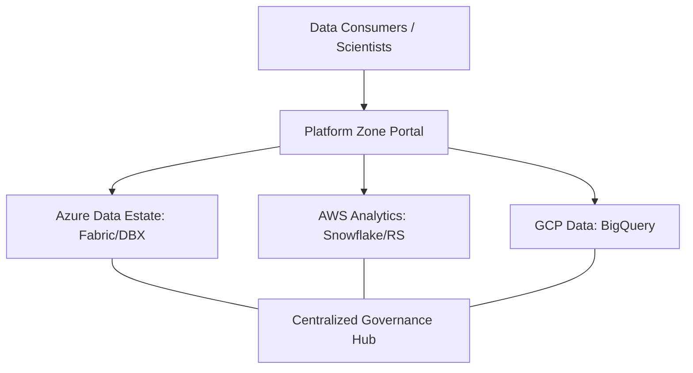

### 2. Detailed Component Topology
The internal service boundaries and management layers of the platform foundation.

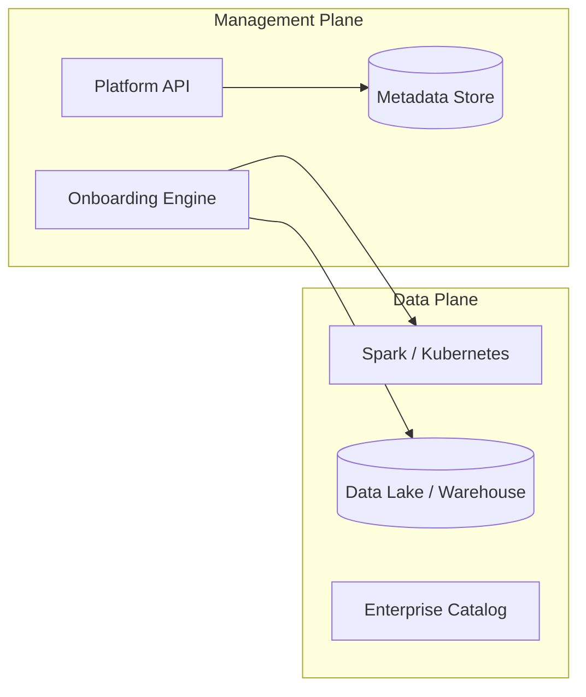

### 3. Frontend to Backend Request Path
Tracing a "Provision New Analytics Workspace" request through the foundation.

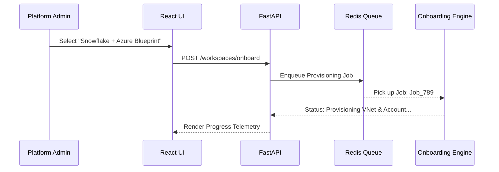

### 4. Multi-Cloud Control Plane
Managing diverse data estates from a single pane of glass.

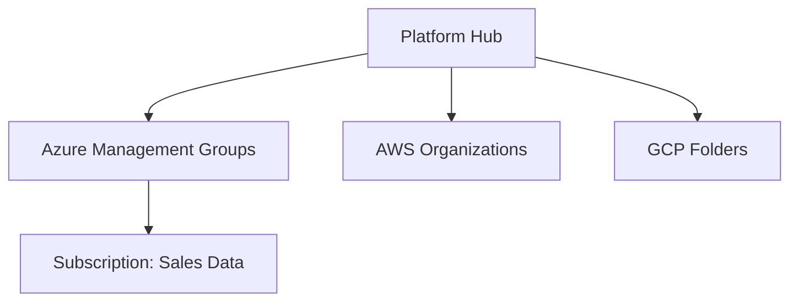

### 5. Management Group / OU Topology
Standardizing the organizational hierarchy for data sovereignty.

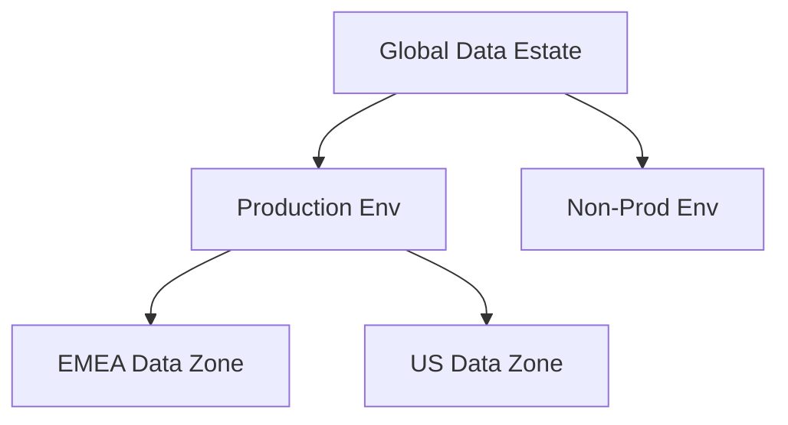

### 6. Regional Deployment Model
Hosting data foundations close to the business for performance and compliance.

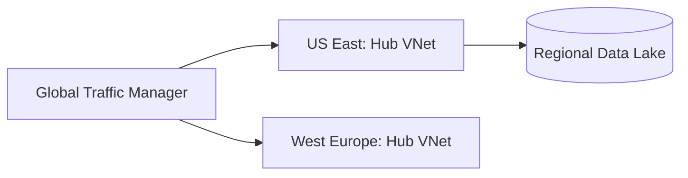

### 7. DR Failover Model
Ensuring the data foundation is resilient to regional cloud outages.

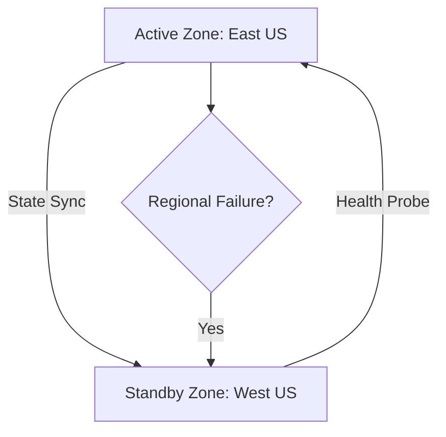

### 8. API Gateway Architecture
Securing and throttling the entry point for foundation orchestration.

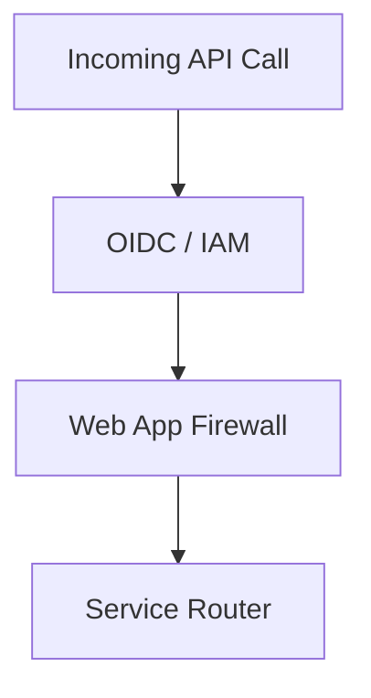

### 9. Queue Worker Architecture
Managing background provisioning and governance validation tasks.

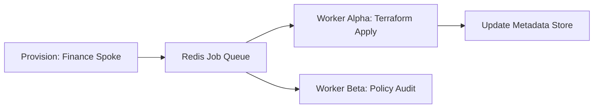

### 10. Dashboard Analytics Flow
How platform telemetry becomes executive reliability scorecards.

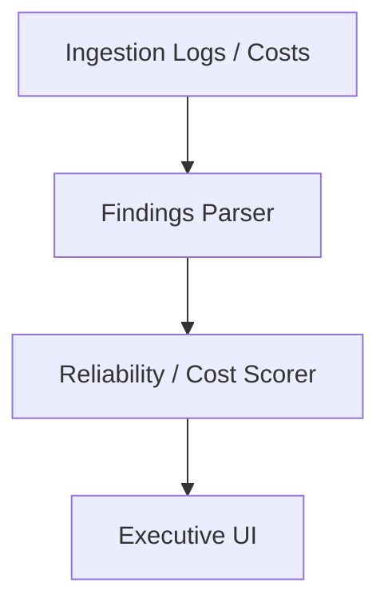

### 11. Hub-spoke Network Model
Isolating data workloads while centralizing egress and security.

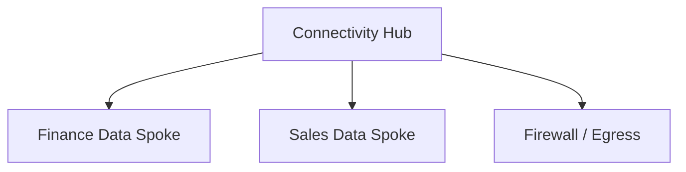

### 12. Shared Services VNet/VPC Topology
Centralizing the "Tools of the Trade" for all data domains.

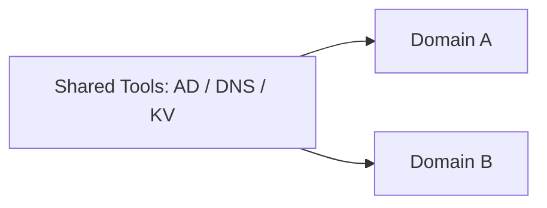

### 13. Transit Gateway Architecture
Connecting multi-cloud and on-prem estates at scale.

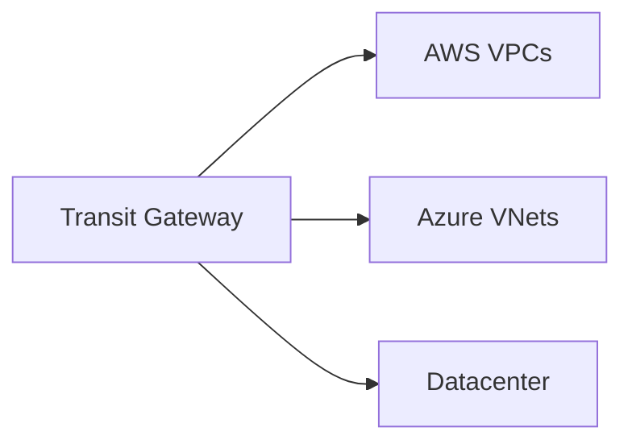

### 14. Private Endpoint Strategy
Ensuring data traffic never crosses the public internet.

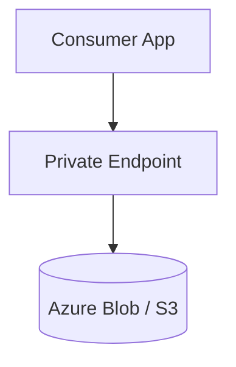

### 15. DNS Resolution Model
Standardizing name resolution across a complex data mesh.

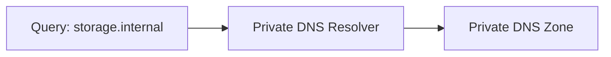

### 16. Firewall Segmentation Flow
Controlling intra-platform lateral movement.

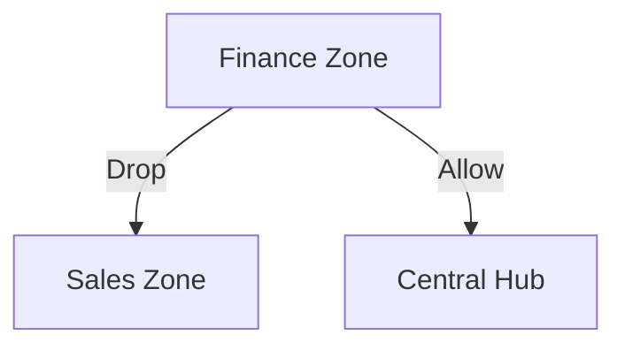

### 17. ExpressRoute / Direct Connect Model
High-speed, dedicated links for massive data ingestion.

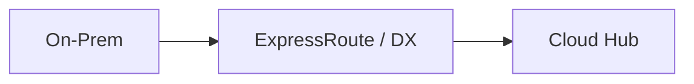

### 18. Egress Control Architecture
Blocking unauthorized data exfiltration.

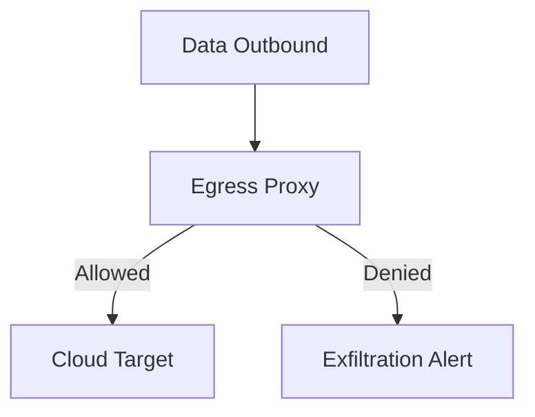

### 19. Cross-Region Connectivity
Global data replication and resilience.

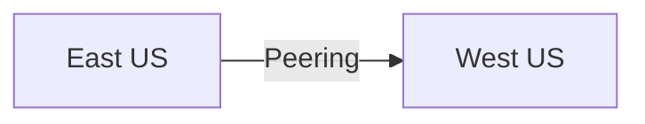

### 20. Bastion Access Workflow
Secure administrative access to data infrastructure.

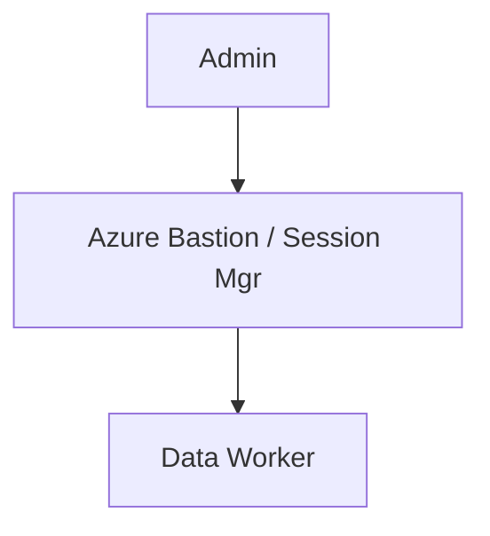

### 21. Enterprise RBAC Hierarchy
Governing access via business-aligned roles.

```mermaid
graph TD
    Root[Global Admin] --> Region[Regional Lead]
    Region --> Domain[Domain Owner]
    Domain --> User[Data Scientist]
```

### 22. SSO Federation Workflow
Unified identity across the entire data stack.

```mermaid
sequenceDiagram
    User->>Portal: Login
    Portal->>IDP: Auth Request
    IDP-->>User: Token
    User->>Databricks: Access via SSO
```

### 23. PAM / JIT Access Model
Eliminating permanent standing privileges.

```mermaid
graph LR
    User[User] --> Request[Request 2h Access]
    Request --> Approve[Manager]
    Approve --> Grant[Active Perms]
```

### 24. Break-glass Workflow
Managing emergency access to critical data zones.

```mermaid
graph TD
    Crisis[Emergency] --> Trigger[Activate Break-Glass]
    Trigger --> Notify[Security Board]
    Trigger --> Logs[High-Audit Mode]
```

### 25. Policy-as-Code Lifecycle
Continuous enforcement of platform standards.

```mermaid
graph LR
    Code[Rego / OPA] --> GHA[Git Check]
    GHA --> Deny[Block Non-Compliant IaC]
```

### 26. Tagging Governance Model
Enforcing accountability through metadata.

```mermaid
graph TD
    Resource[New S3 Bucket] --> TagCheck[Mandatory: CostCenter, Env]
    TagCheck -->|Fail| Terminate[Auto-Delete]
```

### 27. Budget Control Workflow
Protecting the organization from data cost spikes.

```mermaid
graph LR
    Usage[Cloud Spend] --> Budget[Limit: $50k]
    Budget -->|Exceeded| Throttle[Slow Ingestion]
```

### 28. Chargeback Model
Directly linking data spend to business value.

```mermaid
graph TD
    Bill[Cloud Bill] --> Allocate[Shared Service Split]
    Allocate --> Dept[Dept Invoice]
```

### 29. Domain Ownership Matrix
Defining who is responsible for what.

```mermaid
graph LR
    Domain[Customer Data] --> Lead[CFO Office]
```

### 30. Exception Approval Workflow
Managing legitimate deviations from platform standards.

```mermaid
graph TD
    Req[Exception] --> Arch[Architect Review]
    Arch --> Approved[Temp Variance]
```

### 31. Databricks Workspace Onboarding
Industrialized deployment of lakehouse environments.

```mermaid
graph LR
    VNet[Data VNet] --> DBX[Databricks Workspace]
```

### 32. Snowflake Account Topology
Managing multi-account Snowflake deployments.

```mermaid
graph TD
    Org[Snowflake Org] --> Account1[Sales]
    Org --> Account2[Finance]
```

### 33. Fabric Workspace Model
SaaS data estates on Microsoft Fabric.

```mermaid
graph LR
    Capacity[F-SKU] --> Workspace[Domain A]
```

### 34. Synapse Deployment Pattern
Enterprise-scale SQL analytics on Azure.

```mermaid
graph TD
    Net[Private Net] --> Syn[Synapse Workspace]
```

### 35. BigQuery Project Model
GCP native analytics organization.

```mermaid
graph LR
    Folder[Data Folder] --> Project[BQ Project]
```

### 36. Redshift Workspace Flow
AWS data warehouse lifecycle.

```mermaid
graph TD
    Net[VPC] --> RS[Redshift Serverless]
```

### 37. Catalog Integration Workflow
Standardizing metadata discovery.

```mermaid
graph LR
    NewTable[New Table] --> Scan[Purview / Alation Scan]
```

### 38. Data Product Onboarding
Defining and publishing data for consumption.

```mermaid
graph TD
    Data[Raw Assets] --> Wrap[Product Specification]
    Wrap --> Publish[Marketplace]
```

### 39. Sandbox Lifecycle
Self-service environments for data experimentation.

```mermaid
graph LR
    Req[Request Sandbox] --> AutoProv[Provision 30d]
    AutoProv --> AutoDel[Tear Down]
```

### 40. Data Mesh Domain Enablement
Empowering autonomous domain teams.

```mermaid
graph TD
    Domain[Domain A] --> Zone[Platform Spoke]
```

### 41. BI Semantic Model Flow
Providing the "Single Version of Truth."

```mermaid
graph LR
    Gold[Gold Data] --> Semantic[Metrics Layer]
    Semantic --> User[Power BI]
```

### 42. Power BI Integration
Securely connecting Power BI to the data lake.

```mermaid
graph TD
    PBI[Power BI Service] --> Gateway[VNet Gateway]
    Gateway --> Lake[Data Lake]
```

### 43. ML Workspace Onboarding
Deploying high-performance compute for data science.

```mermaid
graph LR
    Compute[GPU Clusters] --> Workspace[Azure ML / SageMaker]
```

### 44. Feature Store Integration
Reusing ML features across the foundation.

```mermaid
graph TD
    Gold[Gold] --> Store[Feature Store]
```

### 45. Notebook Collaboration Model
Standardizing data science workflows.

```mermaid
graph LR
    User[Scientist] --> Notebook[Shared Workspace]
```

### 46. GenAI Secure Data Access
Governing data access for LLM RAG patterns.

```mermaid
graph TD
    LLM[LLM Agent] --> Mask[Privacy Masking]
    Mask --> PrivateData[Sensitive Lake]
```

### 47. Streaming Analytics Model
Monitoring real-time business events.

```mermaid
graph LR
    Event[Kafka] --> Spark[Streaming Job]
```

### 48. CDC Ingestion Workflow
Keeping the foundation in sync with source systems.

```mermaid
graph TD
    Source[ERP] --> Debezium[CDC Agent]
    Debezium --> Bronze[Bronze Lake]
```

### 49. Batch Pipeline Model
Standardized patterns for massive historical loads.

```mermaid
graph LR
    Src[Files] --> Orchestrate[Airflow / ADF]
    Orchestrate --> Target[Gold]
```

### 50. Data Quality Gates
Blocking "dirty data" before it impacts the business.

```mermaid
graph TD
    Data[Ingest] --> Validate[Quality Rule]
    Validate -->|Fail| Quarantine[Audit Table]
```

### 51. Key Management Workflow
Protecting the "Keys to the Kingdom."

```mermaid
graph LR
    Key[Encryption Key] --> Vault[HSM / KeyVault]
```

### 52. Secrets Management Flow
Securing service-to-service communication.

```mermaid
graph TD
    App[API] --> Fetch[Get Redis Pass]
    Fetch --> Secret[KeyVault]
```

### 53. Audit Logging Architecture
Ensuring every action is recorded and immutable.

```mermaid
graph LR
    Action[User Action] --> LogStore[(Immutable Storage)]
```

### 54. Metrics Pipeline
Real-time platform foundation health.

```mermaid
graph TD
    Engine[Engine] --> Prom[Prometheus]
```

### 55. Logging Architecture
Centralized observability for distributed zones.

```mermaid
graph LR
    Col[Collector] --> Loki[Grafana Loki]
```

### 56. Tracing Model
Tracing complex multi-cloud orchestration.

```mermaid
graph TD
    Request[Onboard Req] --> Trace[OpenTelemetry Trace]
```

### 57. SLA Monitoring Flow
Guaranteeing platform availability for the business.

```mermaid
graph LR
    Status[Uptime] --> Alert[99.9% Breach]
```

### 58. Incident Escalation Workflow
Managing platform outages efficiently.

```mermaid
graph TD
    Detect[Outage] --> Pager[On-Call P1]
```

### 59. Backup / DR Workflow
Guaranteeing data durability.

```mermaid
graph LR
    Data[Active] --> Backup[Geo-Redundant Copy]
```

### 60. Release Pipeline Workflow
Continuous delivery of foundation updates.

```mermaid
graph TD
    Code[Code Commit] --> Deploy[Terraform Apply]
```

### 61. Platform Team Model
Defining the roles that run the foundation.

```mermaid
graph LR
    Core[Foundation Team] --> Domain[Domain Leads]
```

### 62. Intake Request Workflow
Governing the "Entry Point" to the platform.

```mermaid
graph TD
    Req[New Zone] --> Design[Review Committee]
```

### 63. Onboarding Approval Lifecycle
Standardizing the transition to production.

```mermaid
graph LR
    Check[Security Check] --> Signoff[Live]
```

### 64. Executive KPI Review
Reporting platform maturity to the board.

```mermaid
graph TD
    KPIs[Stats] --> Deck[Executive Report]
```

### 65. Maturity Roadmap
The journey from "Legacy Silo" to "Intelligent Foundation."

```mermaid
graph LR
    Phase1[Standardize] --> Phase2[Scale]
```

---

## 🔬 Data Platform Zone Methodology

### 1. The Foundation Pillars
Our landing zone is built on four core pillars:
- **Connectivity**: Private-first networking with centralized egress.
- **Identity**: Federated OIDC/SSO with Just-in-Time (JIT) access.
- **Security**: Embedded encryption, auditability, and policy-as-code.
- **Automation**: Everything is code, from the network to the dataset.

### 2. Operating Model & RACI
We define a clear **Shared Responsibility Model** between the Central Platform Team and the Business Domains. The platform team manages the **Hub**, while domains own the **Spokes** and their data products.

---

## 🚦 Getting Started

### 1. Prerequisites
- **Terraform** (v1.5+).
- **Docker Desktop**.
- **Azure/AWS/GCP CLI** configured.

### 2. Local Setup
```bash
# Clone the repository
git clone https://github.com/Devopstrio/data-platform-zone.git
cd data-platform-zone

# Start the Zone Control Plane
docker-compose up --build
```
Access the Foundation Portal at `http://localhost:3000`.

---

## 🛡️ Governance & Security
- **Data Sovereignty**: Built-in support for regional landing zones and residency compliance.
- **Immutable Auditability**: All administrative actions and data access events are logged to an immutable store.
- **Security Segmentation**: Domain-level isolation using VNet/VPC peering and fine-grained IAM policies.

---
<sub>&copy; 2026 Devopstrio &mdash; Engineering the Foundation of Industrialized Data Intelligence.</sub>
